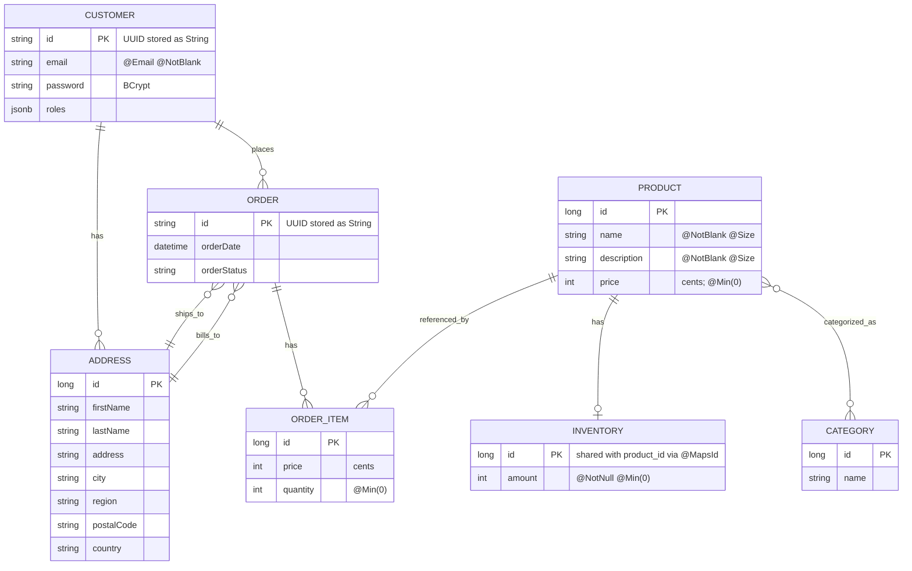

# LetzConsume (Spring Boot + Thymeleaf E‑Commerce)

Traditional Spring MVC + Thymeleaf e-commerce application built for the CNFPC Spring Boot assignment.

## Local Setup (PostgreSQL)

1. Install PostgreSQL.
2. Create the database:

```sql
CREATE DATABASE ecommerce;
```

If you use a different database/user/password, update `application.properties` or use the env vars [below](#configuration).   
[src/main/resources/application.properties](src/main/resources/application.properties)

## Run in Dev Mode

From the project root:

```powershell
.\mvnw.cmd clean spring-boot:run
```

Then open:

- `http://localhost:8080/`

## Build an Executable JAR

```powershell
.\mvnw.cmd clean package
```

This produces a JAR under `target/`.

## Run the JAR

```powershell
java -jar target\cnfpc_spring_boot_project_assignment-0.0.1-SNAPSHOT.jar
```

To run with environment variables (example):

```powershell
$env:SPRING_DATASOURCE_URL = "jdbc:postgresql://localhost:5432/ecommerce"
$env:SPRING_DATASOURCE_USERNAME = "postgres"
$env:SPRING_DATASOURCE_PASSWORD = "root"
$env:APP_LOAD_SAMPLE_DATA = "true"
java -jar target\cnfpc_spring_boot_project_assignment-0.0.1-SNAPSHOT.jar
```

---

# Project Overview

## Tech Stack

- Java 21
- Spring Boot 4.0 (MVC, Thymeleaf, Validation, Data JPA)
- PostgreSQL (JPA/Hibernate)
- Spring Security (form login + role-based access)

## Main Features

**Public (no login required)**
- Home page: `/`
- Product catalog grid: `/products`
- Product detail: `/product/{id}`
- Category browsing: `/category` and `/category/{categoryName}`
- Shopping cart: `/cart` (session-based cart; operations via POST endpoints)

### Cart (Session-Based)

The shopping cart is implemented as a **session-scoped service** (server-side session state).

- Implementation: [src/main/java/lu/arthurmj/cnfpc_spring_boot_project_assignment/service/CartService.java](src/main/java/lu/arthurmj/cnfpc_spring_boot_project_assignment/service/CartService.java) is annotated with `@SessionScope`, so each browser session gets its own cart.
- Persistence: cart items are **not stored in the database** (it’s a simple in-memory `Map<Long, CartItem>` per session).
- Validation & edge cases: cart POST operations validate quantities (`@Valid` on `CartItem`) and enforce inventory limits before adding/updating.

Cart endpoints (see [src/main/java/lu/arthurmj/cnfpc_spring_boot_project_assignment/controller/CartController.java](src/main/java/lu/arthurmj/cnfpc_spring_boot_project_assignment/controller/CartController.java)):

- View cart: `GET /cart`
- Add item: `POST /cart/add`
- Update quantity: `POST /cart/update`
- Remove item: `POST /cart/remove`
- Clear cart: `POST /cart/clear`

**Customer (requires login; role: `CUSTOMER`)**
- Checkout: `/checkout`
- Order history + order details: `/orders`, `/orders/{orderId}`
- Profile page + password update: `/profile`

**Employee/Admin (requires login; role: `EMPLOYEE`)**
- Product CRUD:
  - List: `/admin/products/list`
  - Create: `/admin/products/new`
  - Edit: `/admin/products/edit/{id}`
  - Save: `POST /admin/products/save`
  - Delete: `POST /admin/products/delete/{id}`
- Category CRUD:
  - List: `/admin/category/list`
  - Create: `/admin/category/new`
  - Edit: `/admin/category/edit/{id}`
  - Save: `POST /admin/category/save`
  - Delete: `POST /admin/category/delete/{id}`
- Order management:
  - List: `/admin/orders/list`
  - Detail + status update: `/admin/orders/{orderId}`, `POST /admin/orders/{orderId}/status`

## Database Model (JPA)

Examples of entity relationships implemented:

- `Product` ↔ `Category`: `@ManyToMany` (join table `product_categories`)
- `Product` → `Inventory`: `@OneToOne` (shared primary key via `@MapsId` in `Inventory`)
- `Customer` → `Address`: `@OneToMany`
- `Customer` → `Order`: `@OneToMany` (implemented as `@ManyToOne` from `Order` to `Customer`)
- `Order` → `OrderItem`: `@OneToMany` (cascade + orphan removal)
- `OrderItem` → `Product`: `@ManyToOne`
- `Order` → `Address` (shipping + billing): `@ManyToOne`

Validation is enforced using Jakarta Bean Validation annotations (e.g., `@NotBlank`, `@Email`, `@Size`, `@Min`) and controllers validate POST payloads using `@Valid` + `BindingResult`.



## Authentication & Security

This project uses **Spring Security (Option A)** with session-based form login.

- Login page: `/login`
- Registration page: `/register`
- Username field is configured as `email`.
- Static assets are public: `/css/**`, `/js/**`, `/images/**`
- Authorization rules are defined in [src/main/java/lu/arthurmj/cnfpc_spring_boot_project_assignment/config/SecurityConfig.java](src/main/java/lu/arthurmj/cnfpc_spring_boot_project_assignment/config/SecurityConfig.java)

### Default Roles

- `CUSTOMER`: can checkout, view orders, view profile
- `EMPLOYEE`: can access `/admin/**` (product/category management + order management)
- `ADMIN`: exists in the enum and is used for the sample admin user (also includes `EMPLOYEE`)

## Sample Data (Optional)

On startup, the app can insert sample users, categories, products, and addresses via a `CommandLineRunner`.

- Toggle: `app.load-sample-data` (default in this repo is `true` [src/main/resources/application.properties](src/main/resources/application.properties))
- Initializer: [src/main/java/lu/arthurmj/cnfpc_spring_boot_project_assignment/fixtures/DevDataInitializer.java](src/main/java/lu/arthurmj/cnfpc_spring_boot_project_assignment/fixtures/DevDataInitializer.java)

When enabled and the database has no users, it creates these accounts:

- Admin: `admin@admin.com` / `admin@admin.com`
- Employee: `emp@emp.com` / `emp@emp.com`
- Customer: `cust@cust.com` / `cust@cust.com`

## Configuration

Default configuration lives in:
- [src/main/resources/application.properties](src/main/resources/application.properties)

By default, it points to:

- DB URL: `jdbc:postgresql://localhost:5432/ecommerce`
- DB user: `postgres`
- DB password: `root`
- DDL: `spring.jpa.hibernate.ddl-auto=update`

### Environment Variable Overrides

Spring Boot lets you override `application.properties` via environment variables.

Common overrides:

- `SPRING_DATASOURCE_URL` (e.g. `jdbc:postgresql://localhost:5432/ecommerce`)
- `SPRING_DATASOURCE_USERNAME`
- `SPRING_DATASOURCE_PASSWORD`
- `APP_LOAD_SAMPLE_DATA` (`true` / `false`)


## Project Structure

- MVC Controllers: `src/main/java/.../controller`
- Services: `src/main/java/.../service`
- Repositories: `src/main/java/.../repository`
- Entities/Models: `src/main/java/.../model`
- Security config: `src/main/java/.../config/SecurityConfig.java`
- Thymeleaf templates: `src/main/resources/templates`
  - Layouts: `templates/layouts`
  - Fragments: `templates/fragments`
  - Pages: `templates/pages/**`
- Static assets: `src/main/resources/static` (`css/`, `js/`, `images/`)

## Notes

- Prices are stored in **cents** (integer) in the domain model.
- If you disable sample data (`app.load-sample-data=false`) you’ll need to register a new account via `/register`.
